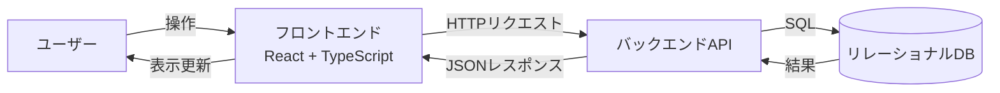
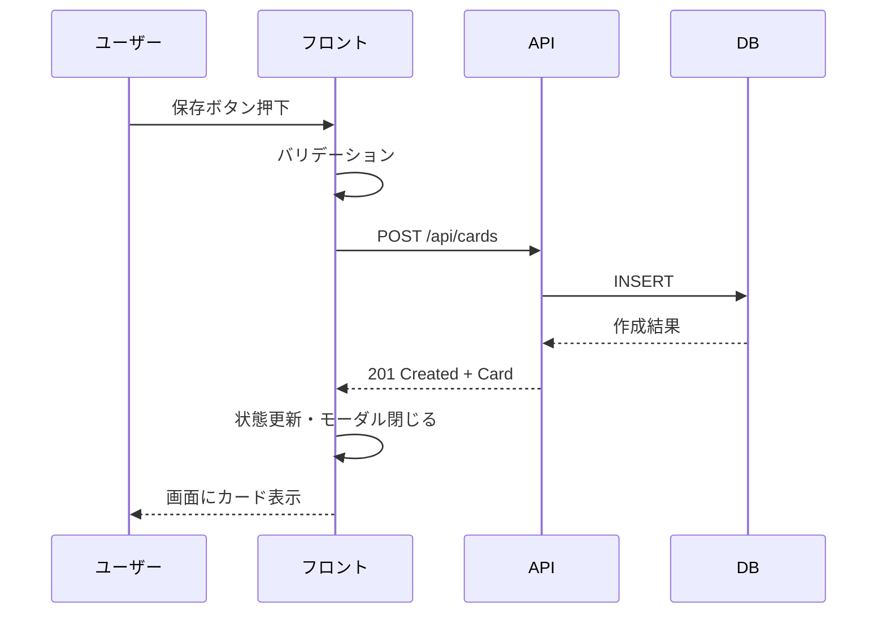
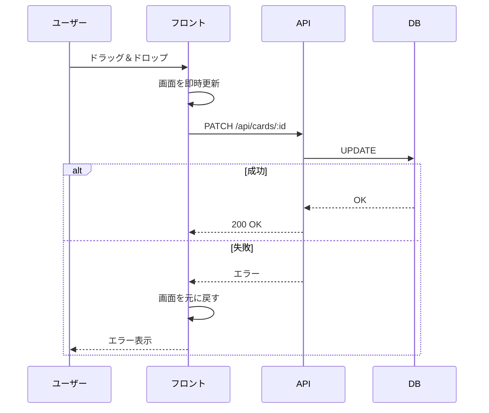

# データフロー

## 全体構成

## API エンドポイント（案）

| メソッド | パス | 用途 |
|---|---|---|
| GET | /api/cards | カード一覧取得 |
| POST | /api/cards | カード新規作成 |
| PATCH | /api/cards/:id | カード更新（編集・移動・並び替え共通） |
| DELETE | /api/cards/:id | カード削除 |

## 代表的なデータフロー例

### カード作成時

### カードのドラッグ移動時（楽観的更新）

