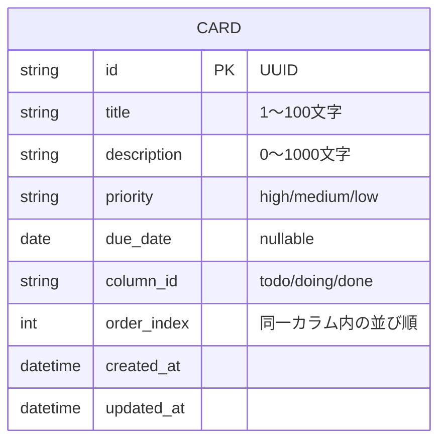

# ER図 / DB設計

## ER図



## テーブル定義: cards

| カラム名 | 型 | NULL | デフォルト | 説明 |
|---|---|---|---|---|
| id | VARCHAR(36) / UUID | NOT NULL | - | 主キー |
| title | VARCHAR(100) | NOT NULL | - | タスク名 |
| description | VARCHAR(1000) | NULL | NULL | 詳細 |
| priority | VARCHAR(10) | NOT NULL | 'medium' | high / medium / low |
| due_date | DATE | NULL | NULL | 期限 |
| column_id | VARCHAR(10) | NOT NULL | - | todo / doing / done |
| order_index | INTEGER | NOT NULL | - | 同一カラム内の表示順 |
| created_at | TIMESTAMP | NOT NULL | 現在時刻 | 作成日時 |
| updated_at | TIMESTAMP | NOT NULL | 現在時刻 | 更新日時 |

## インデックス
- PRIMARY KEY: `id`
- INDEX: `(column_id, order_index)` — カラムごとの並び順取得を高速化

## TypeScript型定義（フロント・バックエンド共通想定）

```ts
type Priority = "high" | "medium" | "low";
type ColumnId = "todo" | "doing" | "done";

type Card = {
  id: string;
  title: string;
  description: string;
  priority: Priority;
  dueDate: string | null; // ISO 8601
  columnId: ColumnId;
  orderIndex: number;
  createdAt: string;
  updatedAt: string;
};
```
