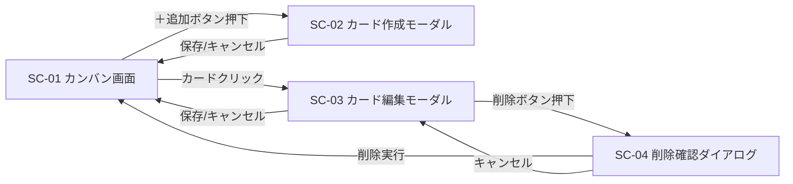

# 画面設計

## 画面一覧

| 画面ID | 画面名 | 種別 |
|---|---|---|
| SC-01 | カンバン画面 | ページ |
| SC-02 | カード作成モーダル | モーダル |
| SC-03 | カード編集モーダル | モーダル |
| SC-04 | 削除確認ダイアログ | ダイアログ |

## SC-01: カンバン画面

### レイアウト
```
┌─────────────────────────────────────────────────────┐
│  タスク管理アプリ                                    │
├──────────────┬──────────────┬──────────────────────┤
│  未着手 (2)   │  作業中 (1)   │  完了 (1)            │
│  [＋ 追加]    │  [＋ 追加]    │  [＋ 追加]           │
│ ┌──────────┐ │ ┌──────────┐ │ ┌──────────┐        │
│ │ カード1   │ │ │ カード3   │ │ │ カード5   │        │
│ │ 優先度:高 │ │ │ 期限:4/30 │ │ └──────────┘        │
│ └──────────┘ │ └──────────┘ │                      │
│ ┌──────────┐ │              │                      │
│ │ カード2   │ │              │                      │
│ └──────────┘ │              │                      │
└──────────────┴──────────────┴──────────────────────┘
```

### UI要素

| 要素 | 仕様 |
|---|---|
| ヘッダー | アプリ名を表示 |
| カラムヘッダー | カラム名 + 件数バッジ |
| 並び替えボタン | 各カラムに1つ。押下するたびに「優先度順」と「期限順」のソートモードが交互に切り替わり、そのカラムを選択中のモードで整列する。<br>・優先度順: 高 → 中 → 低<br>・期限順: 期限の昇順（古い → 新しい）。期限未設定のカードは末尾にまとめる。<br>現在のモードはボタン上のラベルで示す（例: 「優先度順 ▾」/「期限順 ▾」） |
| 追加ボタン | 各カラムに1つ。クリックで SC-02 を開く |
| カード | タイトル・優先度・期限を表示。クリックで SC-03 を開く |
| ドラッグハンドル | カード全体がドラッグ可能（カラム間移動・同一カラム内並び替え） |

### カード表示仕様
- タイトル（必須表示）
- 優先度（色付きバッジ：高=赤 / 中=黄 / 低=青）
- 期限（設定されている場合のみ表示、期限超過は赤文字）
- 説明はカード上には表示しない（編集モーダルで確認）

### 空状態
- カードが0件のカラムには「カードがありません」を淡色で表示

## SC-02: カード作成モーダル

### 入力項目

| 項目 | 入力形式 | バリデーション |
|---|---|---|
| タイトル | テキスト入力 | 必須、1〜100文字 |
| 説明 | テキストエリア | 任意、0〜1000文字 |
| 優先度 | ラジオまたはセレクト | 必須、デフォルト「中」 |
| 期限 | 日付ピッカー | 任意 |

新規作成時のカード配置:
- 同一カラム内で、入力された優先度より低い優先度を持つ最初のカードの直前に挿入する（高 → 中 → 低 の順序を保つ）

### ボタン
- 「保存」: 入力内容でカードを作成、成功時はモーダルを閉じる
- 「キャンセル」: 入力を破棄してモーダルを閉じる

### 挙動
- カラムは「＋追加」を押したカラムに自動設定される
- バリデーションエラーは該当項目の下に赤文字で表示
- 保存処理中はボタンを非活性化

## SC-03: カード編集モーダル

### 入力項目
SC-02 と同一。既存値が初期表示される。
加えて以下を持つ:

| 項目 | 入力形式 | 内容 |
|---|---|---|
| ステータス | セレクト | カラム（未着手 / 作業中 / 完了）を変更可能。DnDが使えない環境向けの代替手段 |

### ボタン
- 「保存」: 更新を実行
- 「削除」: SC-04 を開く
- 「キャンセル」: 変更を破棄

## SC-04: 削除確認ダイアログ

- メッセージ「このカードを削除しますか？この操作は取り消せません。」
- 「削除する」（赤系ボタン）と「キャンセル」

## 画面遷移図


