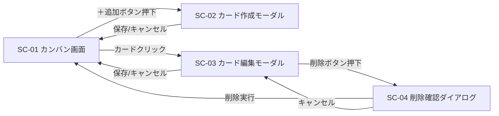
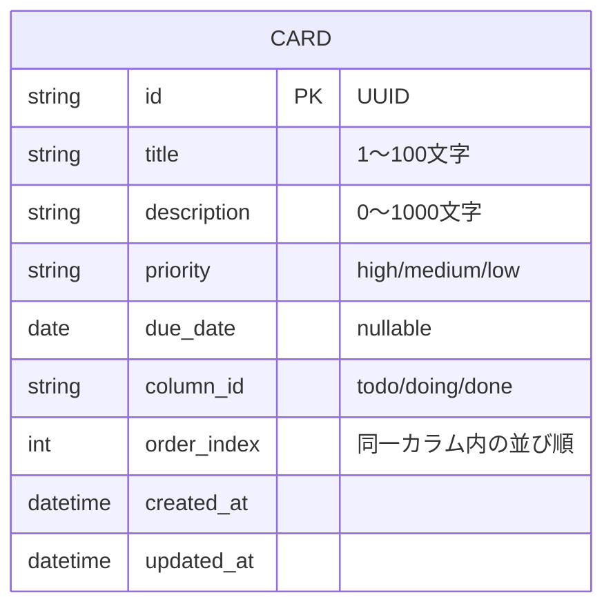
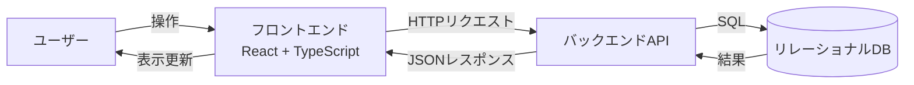
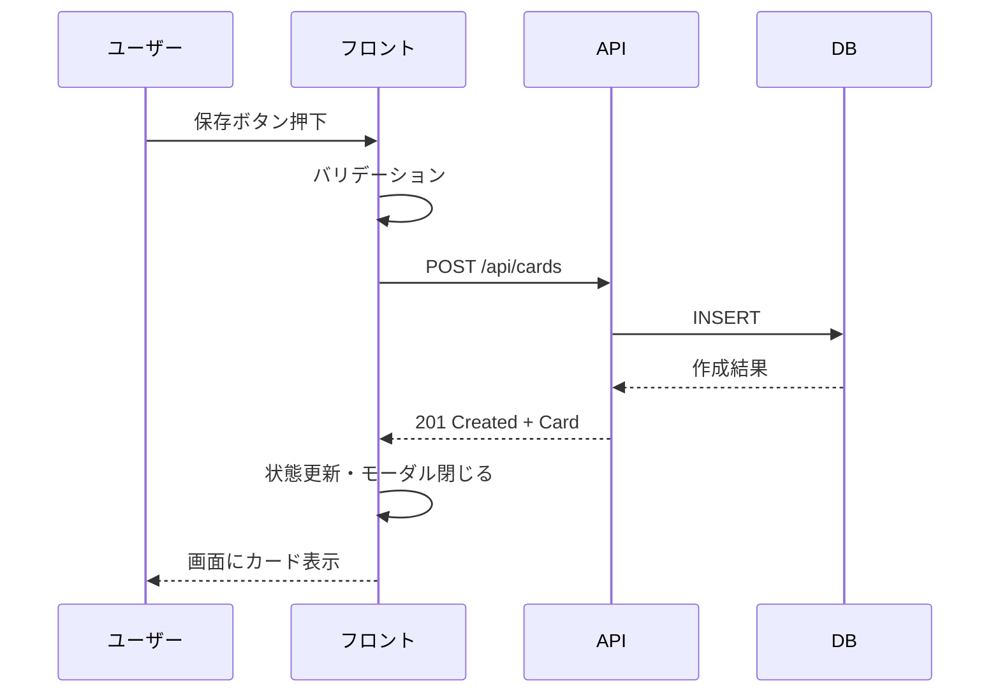
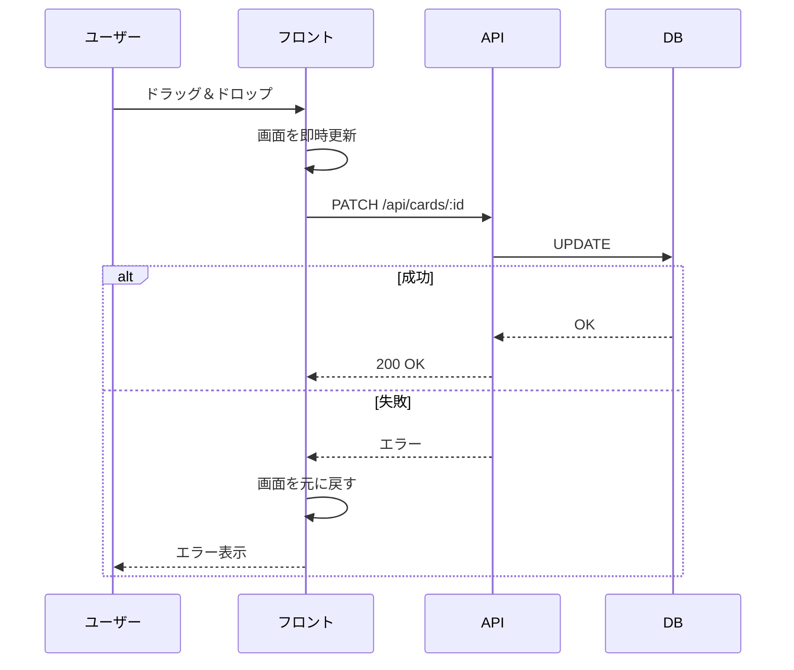

# タスク管理アプリ 要件定義書

## 1. 概要・目的

Trello風のカンバン方式で個人のタスクを管理するWebアプリケーションを開発する。

### 1.1 背景
本アプリは AIエンジニアスクールの学習課題として制作するものである。  
実運用や顧客提供を目的としたプロダクトではなく、要件定義から実装までの一連の開発プロセスを経験し、技術習得を行うことが主眼である。

### 1.2 学習目的
- React + TypeScript によるSPA開発の基礎習得
- 状態管理・イベント処理・コンポーネント設計の実践
- ドラッグ＆ドロップなどインタラクティブUIの実装経験
- バックエンドAPIの設計・実装経験
- リレーショナルDBを用いたデータ永続化の実装経験
- 要件定義〜設計〜実装までの一連の開発プロセスの経験

### 1.3 アプリの目的
個人のタスクを「未着手 / 作業中 / 完了」の3カラムで視覚的に管理できるようにする。

## 2. 利用者・利用環境

- **利用者**: 自分ひとり（単一ユーザー想定、認証機能なし）
- **利用環境**: PCブラウザ（同一環境からの継続利用を想定）
- **同時利用**: 想定しない

## 3. ユースケース / 操作フロー

### 3.1 主要ユースケース一覧

| No | ユースケース | 概要 |
|---|---|---|
| UC-01 | カード一覧の閲覧 | 画面を開くと3カラムのカードが一覧表示される |
| UC-02 | カードの新規作成 | 任意のカラムにカードを追加する |
| UC-03 | カードの編集 | 既存カードの属性を変更する |
| UC-04 | カードの削除 | 不要なカードを削除する |
| UC-05 | カードのカラム間移動 | ドラッグ＆ドロップで別カラムへ移動する |
| UC-06 | カードの並び替え | 同一カラム内でカードの順序を入れ替える |

### 3.2 操作フロー

#### UC-02: カードの新規作成
1. ユーザーが対象カラムの「＋ 追加」ボタンを押下する
2. カード作成モーダルが開く
3. ユーザーがタイトル（必須）・説明・優先度・期限を入力する
4. 「保存」ボタンを押下する
5. バリデーションを通過した場合、APIへリクエストを送信する
6. サーバーがDBに保存し、作成したカード情報を返却する
7. 画面に新しいカードが追加表示される
8. バリデーションエラー時はモーダル内にエラーメッセージを表示する

#### UC-03: カードの編集
1. ユーザーがカードをクリックする
2. カード編集モーダルが開き、現在の値が初期表示される
3. ユーザーが任意の属性を変更する
4. 「保存」ボタンを押下する
5. APIへ更新リクエストを送信する
6. サーバーがDBを更新し、更新後のカード情報を返却する
7. 画面のカード表示が更新される

#### UC-04: カードの削除
1. 編集モーダル内の「削除」ボタンを押下する
2. 確認ダイアログが表示される
3. 「削除する」を選択するとAPIへ削除リクエストを送信する
4. サーバーがDBから削除し、成功を返却する
5. 画面からカードが消える

#### UC-05: カードのカラム間移動
1. ユーザーがカードをドラッグする
2. 別カラム上へドロップする
3. 画面上は即座にカードの所属カラムが変わる（楽観的更新）
4. APIへ更新リクエスト（columnId と order）を送信する
5. サーバーがDBを更新する
6. 失敗した場合は画面を元に戻し、エラーメッセージを表示する

#### UC-06: 同一カラム内の並び替え
1. ユーザーがカードをドラッグする
2. 同一カラム内の別の位置にドロップする
3. 画面上は即座に順序が変わる（楽観的更新）
4. APIへ更新リクエスト（order）を送信する
5. サーバーがDBを更新する

## 4. 機能要件

### 4.1 画面構成
- 画面は1画面のみ（ボード切り替え機能なし）
- 画面上に「未着手 / 作業中 / 完了」の3カラムを横並びで常時表示する
- カラムは固定（追加・削除・名前変更は行わない）

### 4.2 カード（タスク）機能
カードは以下の属性を持つ：

| 属性 | 型 | 必須 | 内容 |
|---|---|---|---|
| ID | 文字列(UUID) | ○ | 一意識別子。サーバー側で採番 |
| タイトル | 文字列 | ○ | タスク名。1〜100文字 |
| 説明 | 文字列 | － | 詳細情報。0〜1000文字 |
| 優先度 | enum | ○ | 高 / 中 / 低 |
| 期限 | 日付 | － | 期限日 |
| カラムID | enum | ○ | todo / doing / done |
| 並び順 | 数値 | ○ | 同一カラム内での表示順。サーバー管理 |
| 作成日時 | 日時 | ○ | サーバー側で自動設定 |
| 更新日時 | 日時 | ○ | サーバー側で自動設定 |

### 4.3 操作
- カードの新規作成（任意のカラムに追加）
- カードの編集（ID・作成日時以外の全属性を変更可能）
- カードの削除
- カードのカラム間ドラッグ＆ドロップ移動
- 同一カラム内のドラッグ＆ドロップ並び替え

### 4.4 データ永続化
- すべてのデータはバックエンドAPI経由でリレーショナルDBに保存する
- フロントエンドはブラウザを閉じてもデータが保持される（DB保存のため）

## 5. 画面設計

### 5.1 画面一覧

| 画面ID | 画面名 | 種別 |
|---|---|---|
| SC-01 | カンバン画面 | ページ |
| SC-02 | カード作成モーダル | モーダル |
| SC-03 | カード編集モーダル | モーダル |
| SC-04 | 削除確認ダイアログ | ダイアログ |

### 5.2 SC-01: カンバン画面

#### レイアウト
```
┌─────────────────────────────────────────────────────┐
│  タスク管理アプリ                                    │
├──────────────┬──────────────┬──────────────────────┤
│  未着手 (2)   │  作業中 (1)   │  完了 (1)            │
│  [＋ 追加]    │  [＋ 追加]    │  [＋ 追加]           │
│ ┌──────────┐ │ ┌──────────┐ │ ┌──────────┐        │
│ │ カード1   │ │ │ カード3   │ │ │ カード5   │        │
│ │ 優先度:高 │ │ │ 期限:4/30 │ │ └──────────┘        │
│ └──────────┘ │ └──────────┘ │                      │
│ ┌──────────┐ │              │                      │
│ │ カード2   │ │              │                      │
│ └──────────┘ │              │                      │
└──────────────┴──────────────┴──────────────────────┘
```

#### UI要素

| 要素 | 仕様 |
|---|---|
| ヘッダー | アプリ名を表示 |
| カラムヘッダー | カラム名 + 件数バッジ |
| 追加ボタン | 各カラムに1つ。クリックで SC-02 を開く |
| カード | タイトル・優先度・期限を表示。クリックで SC-03 を開く |
| ドラッグハンドル | カード全体がドラッグ可能 |

#### カード表示仕様
- タイトル（必須表示）
- 優先度（色付きバッジ：高=赤 / 中=黄 / 低=青）
- 期限（設定されている場合のみ表示、期限超過は赤文字）
- 説明はカード上には表示しない（編集モーダルで確認）

#### 空状態
- カードが0件のカラムには「カードがありません」を淡色で表示

### 5.3 SC-02: カード作成モーダル

#### 入力項目

| 項目 | 入力形式 | バリデーション |
|---|---|---|
| タイトル | テキスト入力 | 必須、1〜100文字 |
| 説明 | テキストエリア | 任意、0〜1000文字 |
| 優先度 | ラジオまたはセレクト | 必須、デフォルト「中」 |
| 期限 | 日付ピッカー | 任意 |

#### ボタン
- 「保存」: 入力内容でカードを作成、成功時はモーダルを閉じる
- 「キャンセル」: 入力を破棄してモーダルを閉じる

#### 挙動
- カラムは「＋追加」を押したカラムに自動設定される
- バリデーションエラーは該当項目の下に赤文字で表示
- 保存処理中はボタンを非活性化

### 5.4 SC-03: カード編集モーダル

#### 入力項目
SC-02 と同一。既存値が初期表示される。

#### ボタン
- 「保存」: 更新を実行
- 「削除」: SC-04 を開く
- 「キャンセル」: 変更を破棄

### 5.5 SC-04: 削除確認ダイアログ

- メッセージ「このカードを削除しますか？この操作は取り消せません。」
- 「削除する」（赤系ボタン）と「キャンセル」

## 6. 画面遷移図



## 7. ER図 / DB設計

### 7.1 ER図



### 7.2 テーブル定義: cards

| カラム名 | 型 | NULL | デフォルト | 説明 |
|---|---|---|---|---|
| id | VARCHAR(36) / UUID | NOT NULL | - | 主キー |
| title | VARCHAR(100) | NOT NULL | - | タスク名 |
| description | VARCHAR(1000) | NULL | NULL | 詳細 |
| priority | VARCHAR(10) | NOT NULL | 'medium' | high / medium / low |
| due_date | DATE | NULL | NULL | 期限 |
| column_id | VARCHAR(10) | NOT NULL | - | todo / doing / done |
| order_index | INTEGER | NOT NULL | - | 同一カラム内の表示順 |
| created_at | TIMESTAMP | NOT NULL | 現在時刻 | 作成日時 |
| updated_at | TIMESTAMP | NOT NULL | 現在時刻 | 更新日時 |

### 7.3 インデックス
- PRIMARY KEY: `id`
- INDEX: `(column_id, order_index)` — カラムごとの並び順取得を高速化

### 7.4 TypeScript型定義（フロント・バックエンド共通想定）

```ts
type Priority = "high" | "medium" | "low";
type ColumnId = "todo" | "doing" | "done";

type Card = {
  id: string;
  title: string;
  description: string;
  priority: Priority;
  dueDate: string | null; // ISO 8601
  columnId: ColumnId;
  orderIndex: number;
  createdAt: string;
  updatedAt: string;
};
```

## 8. データフロー

### 8.1 全体構成



### 8.2 API エンドポイント（案）

| メソッド | パス | 用途 |
|---|---|---|
| GET | /api/cards | カード一覧取得 |
| POST | /api/cards | カード新規作成 |
| PATCH | /api/cards/:id | カード更新（編集・移動・並び替え共通） |
| DELETE | /api/cards/:id | カード削除 |

### 8.3 代表的なデータフロー例

#### カード作成時


#### カードのドラッグ移動時（楽観的更新）


## 9. 非機能要件

### 9.1 性能
- カード一覧の初期表示: 1秒以内（カード100件程度を想定）
- カード作成・更新・削除のAPIレスポンス: 500ms以内
- ドラッグ＆ドロップ操作は画面上即時反映（楽観的更新）
- 想定カード件数: 最大500件程度

### 9.2 可用性 / データ保全
- データはDBに保存するため、ブラウザ側の操作では消失しない
- DBバックアップ方針は本課題のスコープ外（学習目的のため）

### 9.3 対応環境
- **ブラウザ**: Chrome / Edge / Safari の最新版およびその1つ前のバージョン
- **画面解像度**: 1280×720 以上（PC想定）
- **モバイル / タブレット**: 対象外

### 9.4 セキュリティ
- 認証は実装しないが、APIは自端末からのアクセスに限定する運用とする
- SQLインジェクション対策としてORMまたはパラメータ化クエリを使用する
- XSS対策としてフロント側で適切にエスケープする

### 9.5 アクセシビリティ
- キーボード操作によるカード追加・編集・削除に対応（ドラッグ＆ドロップのキーボード代替は学習余力があれば対応）
- フォーム要素には適切な label を付与する

### 9.6 保守性 / コード品質
- TypeScript の strict モードを有効化
- ESLint / Prettier によるコード整形・静的解析
- コンポーネント単位で責務を分離する

### 9.7 国際化
- 日本語のみ対応

## 10. 対象外機能（スコープ外）

今回は以下の機能は **作らない**：

- ユーザー認証・ログイン
- 複数ユーザー対応・共有
- 複数ボード対応
- カラムのカスタマイズ
- ラベル・タグ・添付ファイル
- コメント機能
- 検索・フィルタ
- 通知・リマインダー
- モバイル対応
- DBバックアップ・リストア機能

## 11. 技術スタック（予定）

| 分類 | 採用技術 |
|---|---|
| フロントエンド | React + TypeScript |
| ビルドツール | Vite |
| ドラッグ＆ドロップ | @dnd-kit/core |
| スタイリング | Tailwind CSS（予定） |
| バックエンド | 未定（後続の技術選定で決定） |
| DB | 未定（リレーショナルDB。後続の技術選定で決定） |
| ORM | 未定 |
